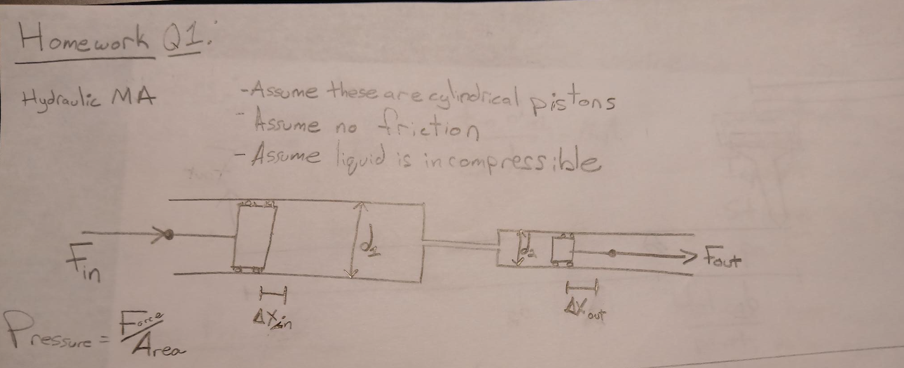

# Simple Machines Homework

## 1: Hydraulic Mechanical Advantage
Look at the following drawing. It shows two hydraulic cylinders and pistons connected via a small hydraulic hose. Determine the mechanical advantage this system exhibits in terms of the variables defined in the drawing. If new variables are to be used, be sure to explain them.

Explain how you determined the mechanical advantage using first principles.

### Assumptions: 
- Both pistons are cylindrical
- Assume no friction
- Assume liquid is incompressible

## 2:

Design 3 UNIQUE compound machines. By unique I mean that each machine cannot share the same set of simple machines that make it up. As well, you are not designing this to the level that it is realizable, much more in the conceptual space. For example, I'm not looking to see where you would place bearings/fasteners etc...  

Explain a potential use case for each of these 3 compound machines.  

Sketch your designs by hand and be sure to label important parameters such as angles, lengths, forces.  

Derive an expression for the Mechanical Advantage of each of your compound machines. Show your work, and write notes to explain and clarify your decisions in determining the Mechanical Advantage expression.